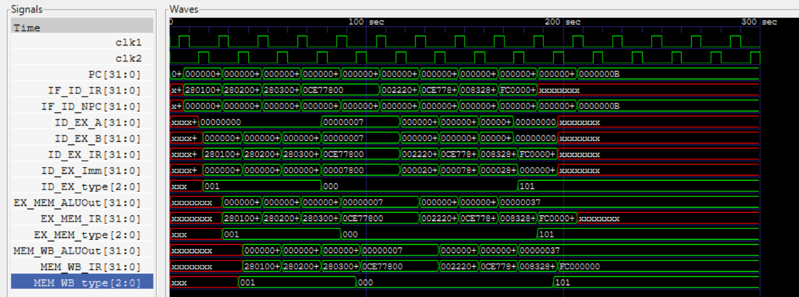

# MIPS32 – 5-Stage Pipelined MIPS Processor (Verilog)

This is a Verilog implementation of a 5-stage pipelined MIPS-32 processor that simulates instruction-level parallelism using a two-phase clock (`clk1` and `clk2`).

## 📌 Features
- Two-phase clock design for efficient pipeline control
- Implements 5 classic pipeline stages: IF, ID, EX, MEM, WB
- Supports basic R-type and I-type MIPS instructions:
  - **Arithmetic & Logic:** ADD, SUB, AND, OR, SLT, MUL
  - **Immediate Operations:** ADDI, SUBI, SLTI
  - **Memory Access:** LW, SW
  - **Control Flow:** BEQZ, BNEQZ
  - **Halt Instruction:** HLT
- Implements basic hazard handling for branches via `TAKEN_BRANCH` signal

## 📂 File Structure
- `pipe_MIPS32.v`: Main Verilog module defining the processor's datapath and control logic

## 🛠️ How It Works
- Uses two clocks (`clk1` and `clk2`) to alternate stages for efficient pipelining.
- Registers like `IF_ID_IR`, `ID_EX_A`, etc., are used for inter-stage communication.
- Simple branching logic implemented with `TAKEN_BRANCH` to manage control hazards.

## 🚀 Usage
You can simulate this design using any Verilog simulator such as:
- ModelSim
- Icarus Verilog
- Xilinx ISim (14.7 compatible)

## 📷 Simulation Output

The following image shows the simulation result/output waveform of the pipelined MIPS processor:

